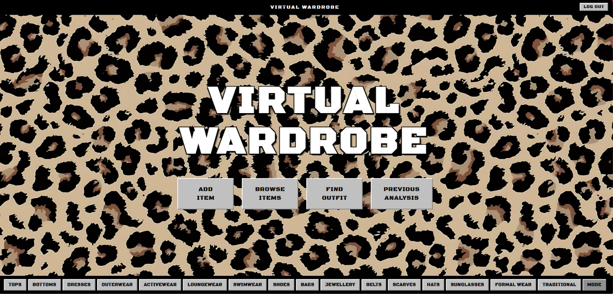
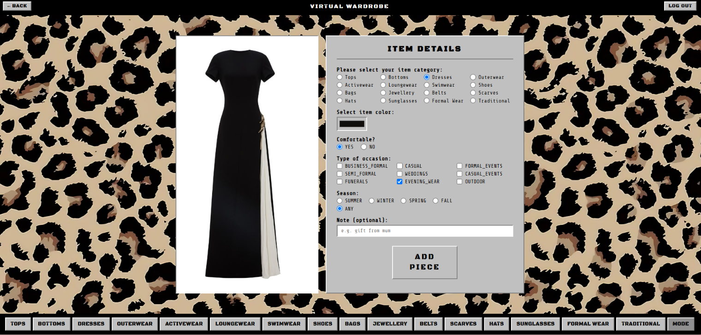
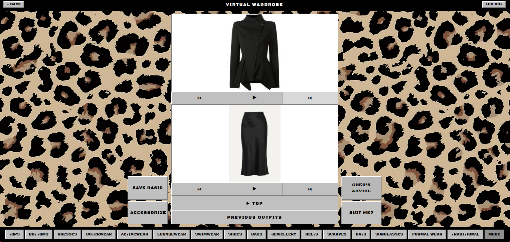
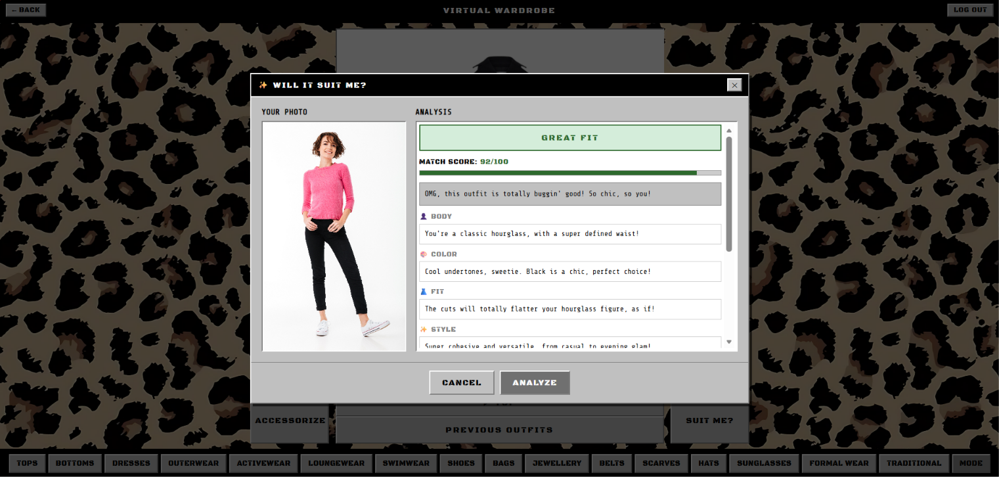

# Virtual Wardrobe — Frontend

The browser-based closet interface for **Virtual Wardrobe** — a retro, Windows-98-styled desktop app, channeling the spirit of Cher Horowitz's iconic computerized wardrobe from *Clueless* (1995).

> This repository contains the **frontend (plain HTML/CSS/JS)**. The backend REST API it talks to lives in a separate repo — see [Backend](#backend) below.

---

## Table of Contents
- [Overview](#overview)
- [Features](#features)
- [Design](#design)
- [Architecture](#architecture)
- [Tech](#tech)
- [Getting Started](#getting-started)
- [Backend](#backend)
- [Roadmap](#roadmap)
- [Author](#author)

---

## Overview

This is a plain HTML/CSS/JavaScript frontend — no framework, no bundler, no build step. It runs entirely in the browser as native ES modules and communicates with the Virtual Wardrobe Spring Boot backend through the Fetch API, using a JWT bearer token for authenticated requests.

## Screenshots






## Features

- **Auth** — register and log in, with a "remember me" option (JWT stored in `localStorage` if remembered, `sessionStorage` otherwise) and a 3-step forgot-password flow (request OTP by email → verify OTP → set new password)
- **Add Item** — upload a photo, then pick category, color, comfort level, one or more occasions, season, and an optional note
- **Browse Items** — filter by category, occasion, season, or comfort, or view everything at once; edit or delete items directly from the grid
- **Find Outfit** — two modes, *Top & Bottom* or *Dress*, with a carousel to cycle through your pieces, plus an **Accessorize** screen to layer on extras
- **Cher's Advice** — quick preset styling questions ("Do they match?", "What occasion?", "Color vibes?", "Rate it", "How to style it?") answered by Gemini through the backend
- **Will It Suit Me?** — upload a photo of yourself and get back a structured AI analysis: a verdict (Great Fit / Might Work / Not Recommended), a match score, a body/color/fit/style breakdown, pros & cons, and concrete suggestions
- **Previous Outfits** — view, edit, or delete outfits you've saved
- **Analysis History** — revisit every past "Will It Suit Me?" result, with expandable detail cards

## Design

- A deliberately retro, **Windows 98-style desktop UI** — title bar, taskbar, raised/inset panel borders, modal dialogs — as a nod to the *Clueless* era
- Two display fonts via Google Fonts: **Black Ops One** for headers, **Share Tech Mono** for body text
- Icons via [Lucide](https://lucide.dev/)

## Architecture

No framework, no bundler — the app is loaded directly as native ES modules (`<script type="module">`). The codebase is deliberately split into four files, each with one job:

| File | Responsibility |
|---|---|
| `js/state.js` | The single source of truth. All mutable app data lives here. No DOM access, no network calls. |
| `js/api.js` | Every call to the backend. One small wrapper function per endpoint, built on `fetch`. |
| `js/ui.js` | Everything that touches the DOM. No `fetch()` calls and no direct state mutation — only rendering and reading form values. |
| `js/app.js` | The glue layer: wires up events, calls into `api.js`, updates `state.js`, and tells `ui.js` what to render. |

It's effectively a hand-rolled version of the "store / service / view / controller" split you'd get for free from a framework — done manually here on purpose, as a way to practice the underlying patterns directly.

## Tech

- Vanilla JavaScript (ES Modules)
- Vanilla CSS — a small custom "Windows 98" component system (`win-raised`, `win-inset`, etc.)
- [Lucide](https://lucide.dev/) icons (via CDN)
- Google Fonts: Black Ops One, Share Tech Mono
- Fetch API with JWT bearer authentication against the backend

## Getting Started

### Prerequisites
- The [Virtual Wardrobe backend](https://github.com/Gannah211/Virtual_Wardrobe) running locally — by default this frontend expects it at `http://localhost:8080`
- Any static file server (browsers can be inconsistent about loading ES modules directly from `file://`)

### Setup

1. **Clone this repository**
   ```bash
   git clone https://github.com/Gannah211/Virtual_Wardrobe_Frontend.git
   cd Virtual_Wardrobe_Frontend
   ```

2. **Point it at your backend (if needed)**

   By default, `js/api.js` expects the backend at `http://localhost:8080`:
   ```javascript
   const BASE_URL = 'http://localhost:8080';
   ```
   Change this if your backend runs somewhere else.

3. **Serve the folder** with any static server — for example:
   ```bash
   npx serve .
   ```
   or
   ```bash
   python -m http.server 5500
   ```

4. **Open it in your browser** (e.g. `http://localhost:5500`), making sure the backend is already running.

## Backend

This repo is the frontend only. The Spring Boot REST API it talks to lives here:

➡️ **Backend repo:** [https://github.com/Gannah211/Virtual_Wardrobe](https://github.com/Gannah211/Virtual_Wardrobe)

## Roadmap

- [ ] Virtual try-on (image-based outfit preview) — scaffolded in code, currently disabled
- [ ] Deploy a live demo
- [ ] Make the backend URL configurable without editing source (e.g. a config file or environment-based setting)

## Author

**Gannah Mohamed**
[GitHub](https://github.com/Gannah211)
